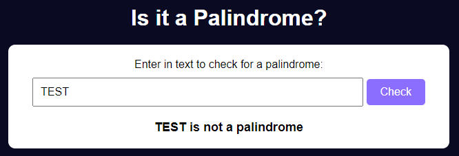

  

  
  
  

# FreeCodeCamp - **Certification Project** Build a Palindrome Checker Project
This is one of the required projects to earn your certification.

For this project, you'll build an application that checks whether a given word is a palindrome.

  <table>
    <tr>
      <td align="center" colspan="2">
        <strong>
Main screen
</strong>
        
      </td>
    </tr>
    <tr>
      <td align="center">
        <strong>
Is a palindrome
</strong>
        
      </td>
      <td align="center">
        <strong>
Is not a palindrome
</strong>
        
      </td>
    </tr>
    <tr>
  </table>

